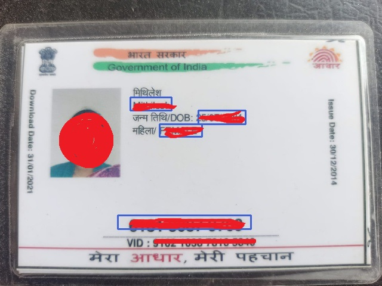

<h1 align="center"> Aadhar Data Extraction👩‍💻👨‍💻</h1>

Aadhar Data Extraction is a computer vision-based tool that uses the YOLO (You Only Look Once) model for object detection and the EasyOCR library for optical character recognition (OCR) to extract personal information from Aadhar cards. The project aims to automate the process of data extraction from Aadhar cards, which are Indian identification cards that contain personal information such as name, Aadhar number, gender, date of birth, etc.

<h2 align="center">Features👨‍🎨</h2>

-> Uses the YOLO model for object detection and localization.  
-> Uses the EasyOCR library for optical character recognition (OCR) to read text from Aadhar card images.   
-> Extracts personal information such as name, Aadhar number, gender, date of birth, etc. from Aadhar cards.   
-> You can save extracted information to a CSV file or any database.   
-> Easy to use with a simple command-line interface.   

<h3 align="center">Installation 🛠👨‍🔧👨‍🔧</h3>

To install and run this project on your local machine, follow these steps:-

1. Clone the repository using <code> git clone https://github.com/arpitmaur07/Aadhar-Data-Extraction.git</code>  
2. Run <code> pip install opencv-python numpy random easyocr</code>   
3. Run the tool using <code>main.py</code>.   

<h3 align="center">Usage🤷‍♂️🤷‍♀️</h3>

To use Aadhar Data Extraction, follow these steps:-

1. Place an image of an Aadhar card in the main folder  
2. Run the tool using <code> main.py</code>   
3. he extracted information will be displayed in the console.   

<h3 align="center">Credits🙆‍♂️</h3>

<b><u>EasyOCR</u></b> for optical character recognition (OCR  
<b><u>YOLOv3</u></b> for object detection and localization   

<h2 align="center">Contact📞📱</h2>

If you have any questions or suggestions, please contact me at <b> <code>marpit440@gmail.com</code></b> 

<h3 >Example:-</h3>

Output image after processing.

<h2 align="center">Yolo custom training video demo for Aadhar Card🎬 </h2>
